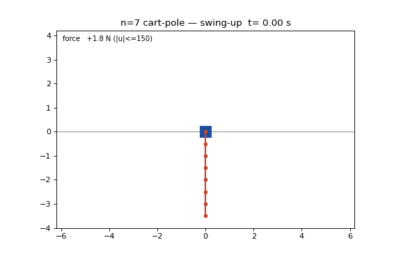

# Septuple Cart-Pole: an open-source, code-reproducible n=7 cart swing-up + balance artifact

This repo extends the n=5 release at
https://github.com/eight-state/quintuple-cartpole and the n=6 release at
https://github.com/eight-state/sextuple-cartpole to **seven links**, and unlike
those it exists because an internal adversarial research program had concluded
n=7 was "~99% impossible, mechanism-confirmed" for a single 150 N cart, and
specifically that it would need a SECOND actuator. That specific verdict was
wrong: this repo demonstrates a single-cart n=7 swing-up + balance and shows
the keystone argument behind the verdict was a numerics error (the
"controller-independent ~0.01° catch basin" was a saturated-LQR artifact; the
true null-controllable region is degrees-scale). What is refuted is the
"impossible / needs a second actuator" claim, NOT a statement that n=7 is as
robust or as easy as n≤6. The artifact perturbs at the (benign) hanging start
and, for the headline 24/24, replans per IC; the genuinely tight, arbitrary-IC
single-input limit is side-stepped by offline re-optimization, not eliminated.
[docs/METHOD.md](docs/METHOD.md) documents what was actually blocking n=7
(three stacked numerics artifacts, no physics), what fixed it, and this scope
boundary.

> **The claim, stated narrowly.** From what our search found, this is the first
> public, code-reproducible n=7 cart-pole swing-up-and-balance artifact by any
> method (the published field stops at n=4; our own n=5/n=6 releases extended
> that). It is: released, runnable, validated code; a saved-nominal replay plus
> saturated closed-loop validation against the same strict committed predicate
> as the n=5/n=6 releases; reproducible after a one-time `uv sync` with a single
> run command; built by trajectory optimization + discrete-time TVLQR + an
> causal per-IC replan, not learning ("causal" = measured state only,
> never rewinds; NO real-time claim is made; per-IC planning compute
> ranges from minutes to hours, see solve_s in the JSONs). It is **not** hardware, **not** a
> formal robustness proof, and the perturbed-IC gate uses a heavier controller
> than n=5/n=6 needed (per-IC replanning; see "What is different at n=7").



## Headline numbers

| Quantity | Value |
|---|---|
| Plant | 7 links x 0.5 m x 0.1 kg, cart 1.0 kg, no damping, ±150 N, ±10 m track |
| Simulator | 1 ms ZOH, RK4 (0.25 ms substeps), hard `np.clip` force saturation |
| Nominal | 8.0 s, peak feedforward **23.3 N** (6.4x margin), terminal 0.0115° |
| Closed-loop monodromy (discrete TVLQR) | **rho = 0.197** |
| Unperturbed swing-up + 5 s hold | **PASS** (peak 23.3 N swing, 27.1 N hold) |
| Perturbed gate, **fixed nominal + TVLQR** (n5/n6-equivalent controller), σ=0.02 | **18/24** (seed 12345) |
| Perturbed gate, **+ per-IC replanning** (heavier controller; minutes to hours/IC), σ=0.02 | **24/24** (seed 12345), **24/24** (seed 777), demanded force ≤ 33.9 N |

**Read the two perturbed-gate rows together: they are not the same
controller.** The n=5 (88/88) and n=6 (48/48) releases use ONE fixed nominal
+ TVLQR feedback. The honest like-for-like number at n=7 is the first row:
the same fixed-nominal architecture passes **18/24** at σ=0.02, and n=7's catch
is genuinely tighter than n≤6. Reaching 24/24 needs the heavier composite
controller, which RE-SOLVES the swing-up NLP per initial condition (minutes
to ~7.6 h of solver time each; the perturbation is absorbed by offline
re-optimization, not rejected by fixed feedback). Both are causal and both
are real; they are different controllers and the table now labels them as
such. The fixed-controller leg is banked in
`results/clvalidate_n7_fixed_seed12345.json`.

Both composite-gate JSONs are single-program, single-run artifacts regenerated inside
this repo layout by `scripts/cl_validate_n7_composite.py` (one uniform
policy and one solver tier for every IC; the per-IC stage used, replan-at-t0
or its documented pre-roll fallback, and the solver settings are recorded in
the JSON). Statistical honesty: 24/24 bounds the per-IC failure probability
only to ≲13.8% at 95% confidence (Wilson); pooling both seeds (48/48)
tightens that to ≲7.4%.
Perturbations are applied at the hanging start, where the closed loop is most
forgiving (errors contract ~5× before the gain ramp); mid-swing or
handoff-time perturbation legs are future work.

## One-command reproduction

```bash
uv sync                              # one-time
uv run python reproduce_n7.py        # ~2 min: rho + unperturbed pass
uv run python reproduce_n7.py --gate # hours (see below): full gate, both seeds
```

The fast path verifies the shipped nominal's rigor facts, builds the
discrete-time TVLQR (rho ~ 0.197), runs the unperturbed closed loop in the
saturated simulator and the 5 s hold. The `--gate` path re-runs the full
perturbed-IC ensemble on BOTH seeds (it re-solves a warm-started trajectory
NLP per IC). Determinism, stated precisely: every rollout is fixed-step
RK4 + ZOH and bitwise deterministic; all solver budgets are
ITERATION-count-only (no wall/CPU-time caps), so on a given platform with the pinned
single-threaded environment the solver paths, the per-IC stage taken, and
the success counts are load-independent, and only wall time varies.
Cross-platform bitwise identity of the IPOPT/MUMPS float paths is not
guaranteed by version pinning alone. (An
earlier revision used a CPU-time cap, which an external re-run proved made
stage selection load-dependent; that build is superseded.) Observed gate wall times for the runs that produced the banked JSONs:
5,660 s (seed 12345) and 27,650 s (seed 777) on a 20-core machine under
partial load; the `gate_clean_seed*.log` footers are ground truth. (The
older `gate_iterbudget_seed*.log` files, 9,415 s / 30,480 s, are from the
v1.0.2-era runs and are retained for history only.) Individual banked
stage-A solves range from 594 s to 27,291 s (~7.6 h); the per-IC solve_s
fields in the JSONs are the ground truth. Banked
validation JSONs/logs for both seeds are in `results/`.

```bash
uv run python -m pytest tests/   # committed rigor gates
```

## Verification boundary

> **"Validated" in this repo means:** the committed scripts reproduce the stated
> success **counts** when the closed loop runs in the force-saturated simulator
> (`rollout_zoh`, hard `np.clip`, RK4 sub-stepping) from perturbed initial
> conditions drawn from the documented Gaussian (sigma=0.02 on cart pos/vel and
> every link angle/rate) at fixed seeds, judged against the committed success
> predicate (every link `|θ|≤5°`, `|θ̇|≤0.5`, `|x|≤2 m`, `|ẋ|≤0.5`, held
> continuously for the final 5 s, on-track over the whole rollout; predicate
> v1, identical to the n=5/n=6 releases). Full-state feedback, exact model,
> deterministic sim. No model mismatch, no measurement noise, no hardware.

## What is different at n=7 (vs the n=5/n=6 recipe)

The n=6 recipe (fixed nominal + continuous-Riccati TVLQR + static-LQR catch)
**fails at n=7 for three reasons that are all numerics, not physics**:

1. **The continuous-Riccati TVLQR with interpolated gains is closed-loop
   unstable along the n=7 nominal** (monodromy rho = 47.85). Fix: discrete-time
   TVLQR, the exact ZOH discretization of the linearization at every 1 ms tick +
   backward discrete Riccati, per-tick gains, zero interpolation
   (`scripts/_dtvlqr.py`). rho drops to 0.197.
2. **The saturated static-LQR catch basin shrinks to ~0.01°**, below the
   perturbed handoff scatter. This basin is a property of the saturated
   high-gain *linear law*, NOT of the plant: the controller-independent
   null-controllable region at the n=7 upright is degrees-scale
   (`scripts/_ncr_hard_bound.py`). Fix: a steering-NLP catch (2 s constrained
   trajectory solve from the measured handoff state, 100 N plan bound) that
   realizes that region, then the static hold.
3. **Perturbed ICs need per-IC replanning**: tracking a fixed nominal from a
   sigma=0.02 IC saturates mid-swing where the gain schedule ramps. Fix: a
   two-stage replan policy. Stage A re-solves the swing-up NLP from the
   measured IC at t=0; stage B (the fallback ONLY when A's t=0 NLP misses its
   iteration budget; tracking divergence after plan commitment is a
   FAILURE, never a fallback) tracks the fixed nominal through the
   benign first 2 s (errors contract ~5x near hanging), then replans the
   remainder. Under the final iteration-only budget ALL 48 banked ICs
   converged via stage A; the earlier CPU-time-capped build routed most
   ICs through stage B purely by load-dependence (see METHOD). Stage B
   remains in the policy as a deterministic fallback; the per-IC stage is
   recorded in the JSONs, and a clearly-labeled demonstration artifact
   (`results/stageB_demonstration_seed12345_tag0.json`, produced by
   `scripts/demo_stage_b.py` with stage A's budget artificially reduced)
   shows the fallback executing end-to-end under the final build; it
   reproduces the superseded CPU-cap era's stage-B result for the same IC
   (peakF 32.207 N) exactly. It is excluded from all counts.

The composite controller is causal full-state feedback with online
computation (replan-then-track; causal, not real-time): the only fallback trigger is the t=0
NLP missing its iteration budget, and tracking divergence after commitment
is scored as failure. Demanded (pre-clip) force never exceeded 33.9 N of
the 150 N budget in any banked trial; the binding constraints at n=7 were
controller numerics, not actuator authority.

## Why this exists: the refuted impossibility verdict

An internal multi-round adversarial research program (4 verified claims, 9
failed-with-mechanism approaches, 13 audited lenses, two reverse-adversary
passes) concluded n=7 was blocked by a "controller- and approach-independent
~0.01° saturated catch basin" and needed a second actuator. A third
reverse-adversary pass found the keystone error: that basin measurement used
one saturated high-gain LQR, and "locally optimal" gain does not bound the
achievable basin under saturation (the Hu-Lin high-gain windup distinction).
Every prior n=7 closed-loop failure traced to untrackable test nominals
(monodromy ~1e248) and the unstable continuous TVLQR, two artifacts that had
mutually shielded each other from diagnosis. [docs/METHOD.md](docs/METHOD.md)
carries the full account; the internal research notes (claims ledger and
reverse-adversary passes) are summarized there.

## Repo map

```
reproduce_n7.py        # one-command reproduction (fast + --gate modes)
configs/nominal.py     # pins the shipped nominal + grid facts
src/cartpole_race/     # dynamics/controller runtime (shared spine with n5/n6)
scripts/
  _dtvlqr.py                    # exact-ZOH discrete-time TVLQR (the rho fix)
  cl_validate_n7_composite.py   # the 24-IC perturbed gate (replan+steer+hold)
  _n7_nominal_4ms.py            # regenerates the 4 ms nominal (2.4 h cold)
  _n7_steer_catch3.py           # steering-catch basin experiment
  _ncr_hard_bound.py            # controller-independent NCR bound
results/
  nom_n7_dense1ms.npz           # THE shipped nominal (1 ms dense)
  nom_n7_4ms.npz                # 4 ms parent solve (warm-start source)
  nom_n7_gluck_cont.npz         # legacy MS warm-start SEED for regenerating
                                # the 4 ms nominal (NOT a shipped trajectory;
                                # predates the track constraint, so its cart
                                # excursion reaches ~40 m, expected; it is a
                                # solver seed, not a result)
  clvalidate_n7_composite_seed12345.json   # 24/24 (regenerated in-repo)
  clvalidate_n7_composite_seed777.json     # 24/24 (regenerated in-repo)
  gate_clean_seed*.log          # the runs that produced the banked JSONs
                                # (absolute paths redacted to <REPO> before commit)
  gate_iterbudget_seed*.log     # earlier v1.0.2-era runs (history)
tests/                 # committed rigor gates (defects, seams, rho<1, ...)
docs/METHOD.md         # what was new at n=7, full account
```

## License

MIT (see [LICENSE](LICENSE)). © 2026 Alex Garcia Gil.
